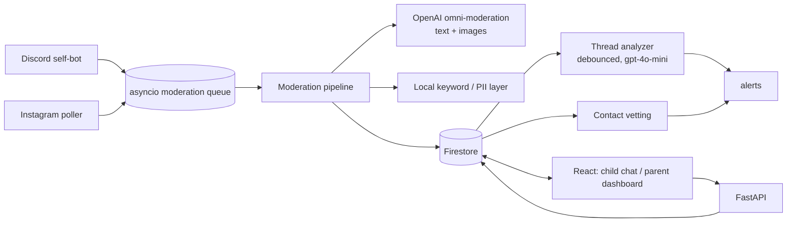

# SafeGuard 2.0

SafeGuard puts a kid's Discord and Instagram DMs into one safe inbox. AI checks every message and image, reads whole conversations for grooming patterns, and vets new contacts. It helps parents talk *with* their kids instead of just blocking everything.

Built for HackGT 13: the Oracle of the Deep (ML/AI) track and Meta's "Bringing People Closer Together with AI" challenge. This rebuilds the original SafeGuard: the homemade RandomForest/DistilBERT/Ollama stack is replaced by OpenAI moderation and reasoning.

## What the AI does

| Feature | Model | Where |
| --- | --- | --- |
| Image moderation (attachments and profile pictures): sexual, violence, self-harm | `omni-moderation-latest` | `backend/app/moderation/image.py` |
| Text moderation: threats, harassment, hate, sexual, self-harm, illicit | `omni-moderation-latest` plus a local profanity/slur/keyword layer | `backend/app/moderation/text.py` |
| Masking: swear words become `•••` and the rest of the message still shows | local | `text.py` |
| Conversation risk: grooming patterns across a thread (secrecy, gifts, meetups, moving apps...) with cited evidence | `gpt-4o-mini` structured outputs | `backend/app/ai/thread_analyzer.py` |
| Contact vetting: approve / watch / block recommendation, plus a question to ask your child | `gpt-4o-mini` | `backend/app/ai/contact_vetting.py` |
| Child coaching: short, kind tips instead of silent censorship, plus a check before sending (catches PII) | `gpt-4o-mini` (cached per situation, with hand-written fallbacks) | `backend/app/ai/coach.py` |
| Weekly parent digest with conversation starters (only aggregate stats are sent, never message text) | `gpt-4o-mini` | `backend/app/ai/digest.py` |

Failures never silently pass as safe. If OpenAI is unreachable, content is marked `needs_review` and hidden from the child until a parent checks it.

## Architecture



- Platform listeners only enqueue work. Moderation runs on async workers, so slow AI calls never stall Discord or Instagram.
- The backend enforces contact rules. New senders are `pending` and hidden from the child. `blocked` senders are never shown. `watch` re-analyzes the thread on every message.
- Only safe media is made public. Flagged media is stored privately, and parents view it through short-lived signed URLs.
- The frontend reads Firestore in real time and calls the API for actions: send, approve/block, re-analyze, digest, and message review.

Firestore collections: `messages`, `sent_messages`, `contacts`, `threads`, `alerts`, `digests`, `settings/app`. No composite indexes are needed.

## Setup

**Requirements:** Python 3.12+ (tested on 3.14), Node 22, a Firebase project (Firestore plus Storage), and an OpenAI API key.

```bash
# Backend
cd backend
python3 -m venv .venv && .venv/bin/pip install -r requirements-dev.txt
cp .env.example .env         # set OPENAI_API_KEY, FIRESTORE_CREDENTIALS_PATH, FIREBASE_STORAGE_BUCKET,
                             # and optionally DISCORD_TOKEN / INSTAGRAM_SESSION_ID
.venv/bin/python -m app.main # http://localhost:8000  (API docs at /docs, status at /health)

# Frontend (second terminal)
cd frontend
cp .env.example .env         # Firebase web config + VITE_API_BASE_URL
npm install && npm run dev   # http://localhost:5173
```

Each platform starts only if its credential is set. `GET /health` shows what's connected.

**Backend env keys:** `OPENAI_API_KEY`, `OPENAI_MODEL` (default `gpt-4o-mini`), `FIRESTORE_CREDENTIALS_PATH`, `FIREBASE_STORAGE_BUCKET`, `FIRESTORE_DATABASE_ID`, `DISCORD_TOKEN`, `DISCORD_DMS_ONLY`, `INSTAGRAM_SESSION_ID`, `INSTAGRAM_USERNAME`, `INSTAGRAM_PASSWORD`, `INSTAGRAM_TOTP_SEED`, `INSTAGRAM_POLL_INTERVAL`, `API_HOST`, `API_PORT`, `CORS_ORIGINS`.

**Tests:**

```bash
cd backend && .venv/bin/python -m pytest   # moderation, pipeline, queue, AI parsing, ingest flow, API
cd frontend && npm test                     # stats transforms, visibility, chat bubble states
```

**Backup/restore Firestore:** `cd backend && .venv/bin/python scripts/firestore_manage.py save|restore|wipe`

## Demo logins

`parent` / `parent123` opens the dashboard. `child` / `child123` opens the chat.

## Known limitations (prototype)

- **No real auth.** Logins are hardcoded in the frontend. The API has no authentication, and Firestore rules must allow the client to read and write. Run it on localhost or a trusted network only.
- **Unofficial platform clients.** The Discord self-bot (`discord.py-self`) and the Instagram session-id client (`instagrapi`) are against those platforms' terms of service. Use test accounts.
- **OpenAI image limits.** Image moderation scores sexual, violence and self-harm only. It is not a CSAM detector. Videos are not scanned; they go to `needs_review`.
